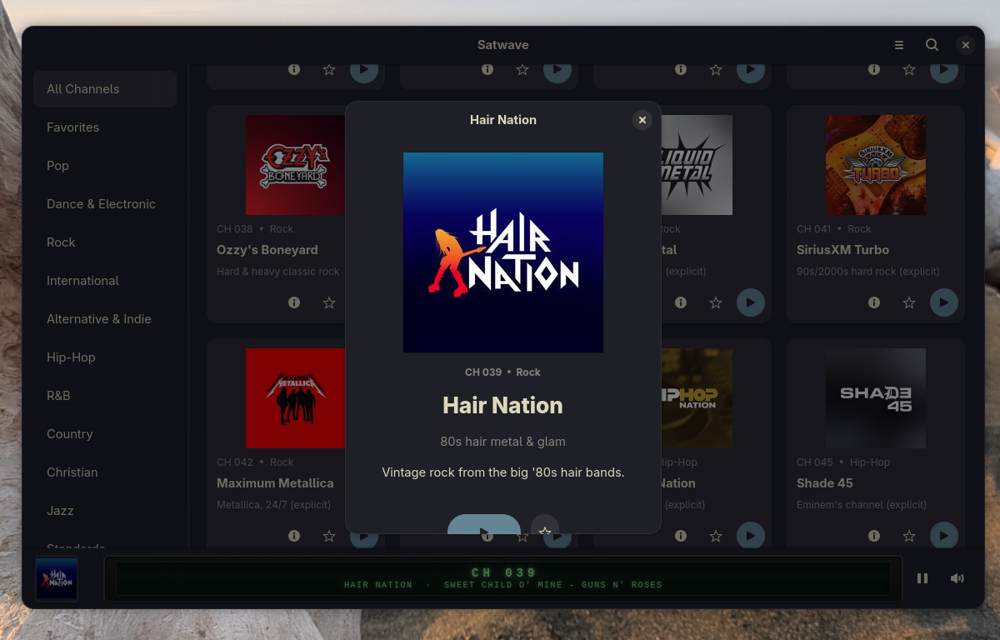

# Satwave

A native GTK4/libadwaita SiriusXM streaming client for Linux.

Satwave lets you browse, search, and play SiriusXM channels from a native GNOME desktop application. It features a retro LCD-style now-playing display, channel artwork, favorites, and category browsing.



## Features

- Browse all SiriusXM channels with artwork and descriptions
- Filter by category (Pop, Rock, Hip-Hop, Country, News, Sports, etc.)
- Search channels by name or number
- Favorites with persistence
- Retro LCD now-playing display with song/artist info
- Channel detail popups with full descriptions
- GStreamer-based HLS audio playback
- Secure credential storage via GNOME Keyring
- Responsive layout

## Requirements

**Build dependencies:**

- GTK 4 (>= 4.14)
- libadwaita (>= 1.4)
- GStreamer (>= 1.22)
- libsoup 3 (>= 3.4)
- json-glib (>= 1.6)
- libsecret (>= 0.20)
- Meson (>= 1.0)
- Ninja

**Runtime GStreamer plugins:**

- `gst-plugins-base`
- `gst-plugins-good`
- `gst-plugins-bad`
- `gst-libav`

### Install dependencies (Arch/CachyOS)

```bash
sudo pacman -S gtk4 libadwaita libsoup3 json-glib libsecret \
  gstreamer gst-plugins-base gst-plugins-good gst-plugins-bad gst-libav \
  meson ninja
```

### Install dependencies (Fedora)

```bash
sudo dnf install gtk4-devel libadwaita-devel libsoup3-devel json-glib-devel \
  libsecret-devel gstreamer1-devel gstreamer1-plugins-base-devel \
  gstreamer1-plugins-good gstreamer1-plugins-bad-free gstreamer1-libav \
  meson ninja-build
```

## Build

```bash
meson setup builddir
meson compile -C builddir
```

## Run

```bash
cd /path/to/satwave
GSETTINGS_SCHEMA_DIR=data ./builddir/satwave
```

## Install

```bash
meson install -C builddir
```

## Disclaimer

Satwave is a 100% unofficial project and you use it at your own risk. It is designed to be used for personal use. It does not record but only plays music from an already licensed account. Similar to playing music over speakers from the radio directly. Using Satwave in any corporate setting, to attempt to pirate music, or to try to make a profit off your subscription may result in YOU getting in legal trouble.

SiriusXM is a registered trademark of Sirius XM Holdings Inc. This project is not affiliated with, endorsed by, or sponsored by Sirius XM Holdings Inc. in any way.

## License

This project is licensed under the GNU General Public License v3.0. See [LICENSE](LICENSE) for details.
